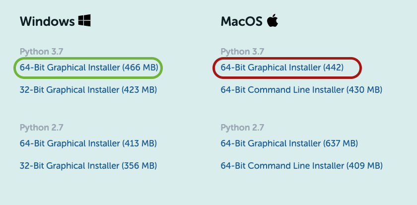
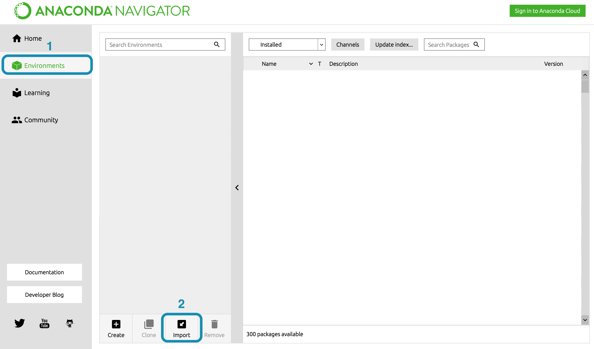
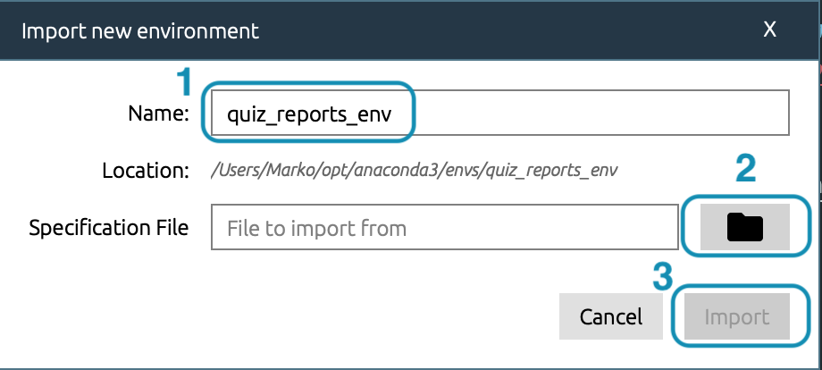
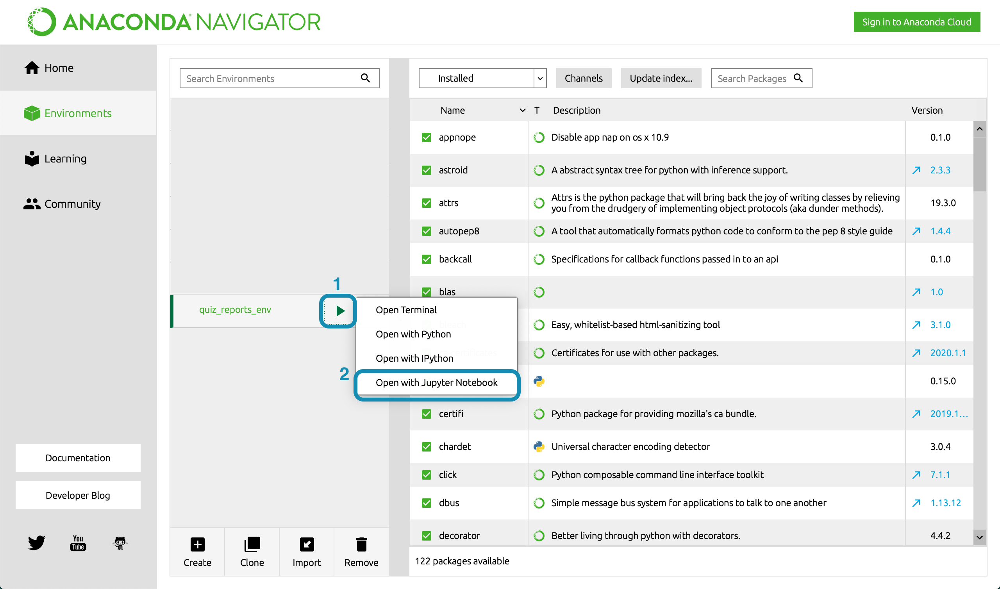
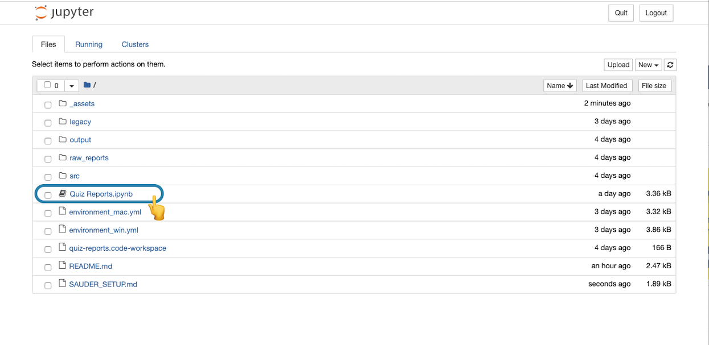
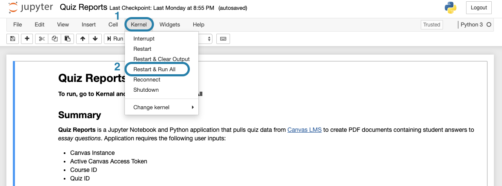

# Getting Started (for Sauder Ops team)

## 🤔 Where to start

- [I **have not** run this script on this computer before](#-first-time-running-it-start-here)
- [I **have** successfully run it on this computer before](#-ran-it-before-start-here)

## 🥇 First time running it? Start here

1. Copy **quiz_reports** folder from TeamShare onto Desktop (or anywhere you'd like)

   - location: `.../Canvas/Canvas API/Operational Scripts/quiz_reports`

1. If not already installed, install [Anaconda](https://www.anaconda.com/products/individual#Downloads) (Python 3.7 version)

   > Note if you are using a older Windows computer you may need to select the 32-Bit Graphical Installer. See [here](https://www.computerhope.com/issues/ch001121.htm) to find out.

   

1. Open Anaconda Navigator:

   1. Open **Anaconda Navigator** application
   1. Click on **Environments** (left panel)
   1. Click on **Import** (bottom)

   

1. Import Environment:

   1. Name the environment "quiz_reports_env"
   1. Navigate to the quiz_reports folder on your computer and select: `environment.yml`
   1. Select **Import** and wait for installation to complete

   

   **Now you're all set up! Time to [run it](#-ran-it-before-start-here)**

## 🚀 Ran it before? Start here

1. Open **Anaconda Navigator**, select the ▶️ button next to "quiz_reports_env" and select **Open with Jupyter Notebook** (this should start your browser)

   

1. In the browser, navigate to the **quiz_reports** project folder and select **Quiz Reports.ipynb** (Note this will be located wherever you saved it in Step 1)

   

1. In the notebook, select **Kernal** > **Restart & Run All**

   
